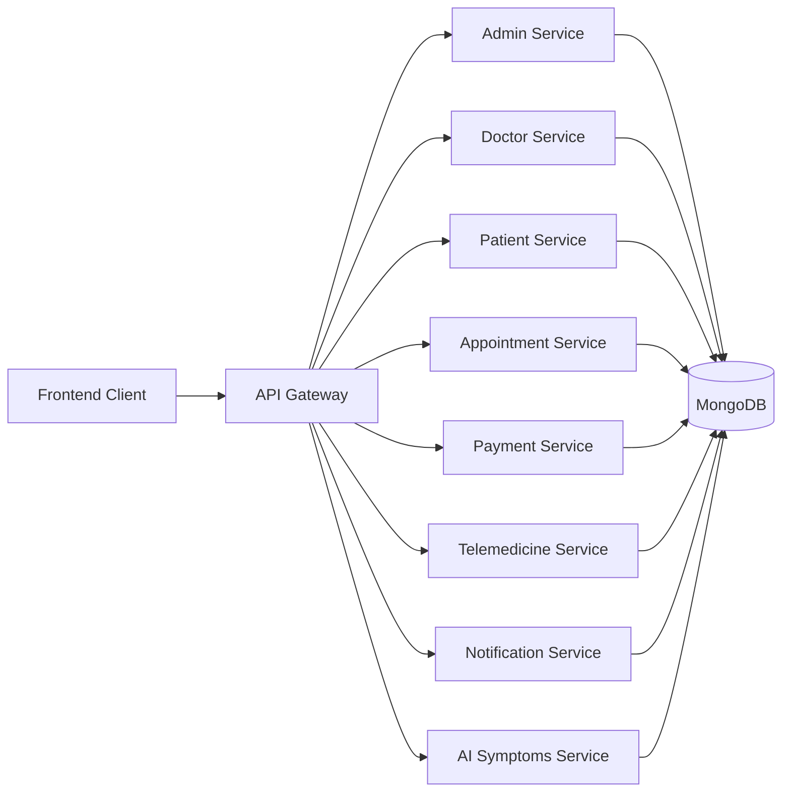

# 🏥 iDoc — AI-Enabled Smart Healthcare Appointment & Telemedicine Platform

<p align="center">
  
  
  
  
  
  
</p>

<p align="center">
  <b>iDoc</b> is a cloud-native healthcare platform built with a <b>gateway-centric microservices architecture</b>.
  It enables patients to book appointments, upload medical reports, attend telemedicine sessions,
  make online payments, and receive AI-assisted preliminary symptom guidance.
</p>

---

## ✨ Key Features

- 👨‍⚕️ **Doctor registration and approval workflow**
- 🧑‍🤝‍🧑 **Role-based access for Admin, Doctor, and Patient**
- 📅 **Appointment booking, cancellation, and rescheduling**
- 💳 **Secure online payment integration with Stripe**
- 🎥 **Telemedicine consultations using Jitsi**
- 📄 **Patient medical report upload and management**
- 💊 **Digital prescription management**
- 🤖 **AI symptom checker with specialty suggestions**
- 🔔 **Notification service for system events**
- 🐳 **Dockerized deployment setup**

---

## 🧱 System Architecture



---

## 🛠️ Tech Stack

| Layer | Technologies |
|---|---|
| Frontend | React, Vite, Tailwind CSS |
| API Gateway | Express.js, http-proxy-middleware |
| Backend Services | Node.js, Express.js |
| Database | MongoDB, Mongoose |
| Authentication | JWT, bcryptjs |
| Payments | Stripe |
| Telemedicine | Jitsi Meet |
| AI Integration | OpenRouter API |
| Notifications | SMTP / Email-based notification flow |
| Containerization | Docker, Docker Compose |

---

## 📦 Microservices Included

- **API Gateway**
- **Admin Service**
- **Doctor Service**
- **Patient Service**
- **Appointment Service**
- **Payment Service**
- **Telemedicine Service**
- **Notification Service**
- **AI Symptoms Service**
- **Frontend Client**

---

## 📁 Project Structure

```bash
IDOC/
├── frontend/
├── gateway/
├── services/
│   ├── admin-service/
│   ├── ai-symptoms-service/
│   ├── appointment-service/
│   ├── doctor-service/
│   ├── notification-service/
│   ├── patient-service/
│   ├── payment-service/
│   └── telemedicine-service/
├── docker-compose.yml
└── README.md
```

---

## 🚀 Getting Started

### 1. Clone the Repository

```bash
git clone https://github.com/idocTeam/IDOC.git
cd IDOC
```

### 2. Configure Environment Variables

Before running the project, review and update the `.env` files inside:

```bash
gateway/.env
frontend/.env
services/admin-service/.env
services/doctor-service/.env
services/patient-service/.env
services/appointment-service/.env
services/payment-service/.env
services/telemedicine-service/.env
services/notification-service/.env
services/ai-symptoms-service/.env
```

### 3. Important Environment Notes

- Set your own **JWT secrets**
- Set your own **Stripe keys**
- Set your own **SMTP email credentials**
- Set your own **OpenRouter API key**
- Confirm all service URLs and client URLs are correct for your environment
- If you are using **MongoDB Atlas**, keep the cloud connection strings in the service `.env` files
- If you want to use **local MongoDB in Docker**, update the `MONGO_URI` values accordingly

> **Security Note:** Do not commit real secrets, API keys, passwords, or production credentials to a public repository.

---

## ▶️ Run with Docker Compose

Build and start all services:

```bash
docker compose up --build
```

Run in detached mode:

```bash
docker compose up --build -d
```

Stop all containers:

```bash
docker compose down
```

Stop and remove volumes:

```bash
docker compose down -v
```

---

## 🌐 Default Local Access URLs

| Component | URL |
|---|---|
| Frontend | http://localhost:5173 |
| API Gateway | http://localhost:5000 |
| Admin Service | http://localhost:5004 |
| Doctor Service | http://localhost:5002 |
| Patient Service | http://localhost:5003 |
| Appointment Service | http://localhost:5007 |
| Payment Service | http://localhost:5005 |
| Telemedicine Service | http://localhost:5006 |
| Notification Service | http://localhost:5008 |
| AI Symptoms Service | http://localhost:3007 |
| MongoDB | mongodb://localhost:27017 |

---

## 🔄 Core Business Flows

### Doctor Flow
- Register as a doctor
- Wait for admin approval
- Log in after approval
- Manage profile and availability
- Accept or reject appointments
- View patient reports
- Issue prescriptions

### Patient Flow
- Register and log in
- Search approved doctors
- View available slots
- Book appointments
- Upload medical reports
- Make payments
- Join telemedicine sessions
- View prescriptions

### Admin Flow
- Log in as admin
- Review pending doctors
- Approve or reject doctor accounts
- Oversee platform operations

---

## 🔐 Security Highlights

- JWT-based authentication
- Role-based authorization
- Password hashing using `bcryptjs`
- Protected service routes
- PDF upload restrictions for medical reports
- CORS and middleware-based API protection

---

## 🧪 Suggested Startup Order for Manual Debugging

If you are not using Docker Compose, a practical startup order is:

```bash
1. MongoDB
2. doctor-service
3. patient-service
4. admin-service
5. notification-service
6. appointment-service
7. payment-service
8. telemedicine-service
9. ai-symptoms-service
10. gateway
11. frontend
```

---

## 👥 Team Members

| Registration Number | Name |
|---|---|
| IT23664012 | D M T Shamendra |
| IT23727472 | Perera H C T |
| IT23815896 | Dilhara H S |
| IT23859210 | G P T Nikeshala |

---

## 📚 Academic Context

This project was developed for:

- **Module:** SE3020 – Distributed Systems
- **Specialization:** BSc (Hons) in Information Technology – Software Engineering
- **Semester:** Year 3 Semester 1
- **Institution:** Sri Lanka Institute of Information Technology (SLIIT)

---

## 📌 Notes

- The project uses a **microservices-based architecture** with a central **API Gateway**.
- The current implementation includes Docker-based deployment support.
- Some services may require valid third-party credentials to work fully, especially:
  - Stripe
  - SMTP Email
  - OpenRouter
  - Jitsi-related integrations

---

## 🤝 Contributors

This project was developed as a group assignment by **Group SE-72**.

---

## 📄 License

This repository was created for academic use.
